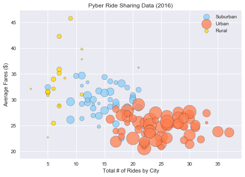
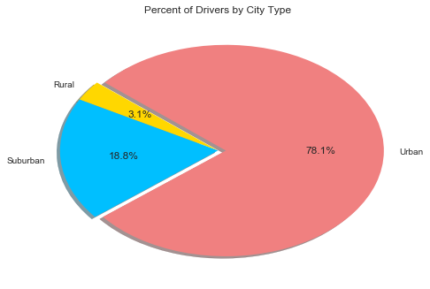

# Your objective is to build a Bubble Plot that showcases the relationship between four key variables:
Average Fare ($) Per City -         group_ride_avg
#Total Number of Rides Per City -    ride_sum
#Total Number of Drivers Per City-   num_driv
#City Type (Urban, Suburban, Rural)
#In addition, you will be expected to produce the following three pie charts:
#% of Total Fares by City Type
#% of Total Rides by City Type
#% of Total Drivers by City Type

#Three observable trends
1- The most obvious trend relates to the city size.  
    a: The larger the city, the more drivers there are.
    b: The larger the city, the lower the average fare (obviously based upon distance traveled).
    c: The smaller the city, the longer the distance, the greater the fare and fewer drivers.
2-Surprising trend is that the combination of rural and suburban fairs combined, tend to be more than fares in urban areas. 


```python
import pandas as pd
import matplotlib.pyplot as plt
import seaborn as sns
import numpy as np
```


```python
path1="Generators/Pyber/generated_data/ride_data.csv"
path2="Generators/Pyber/generated_data/city_data.csv"
ride=pd.read_csv(path1,encoding="utf-8")
city=pd.read_csv(path2,encoding="utf-8")
ride.head()
```


<div>
<style>
    .dataframe thead tr:only-child th {
        text-align: right;
    }

    .dataframe thead th {
        text-align: left;
    }

    .dataframe tbody tr th {
        vertical-align: top;
    }
</style>
<table border="1" class="dataframe">
  <thead>
    <tr style="text-align: right;">
      <th></th>
      <th>city</th>
      <th>date</th>
      <th>fare</th>
      <th>ride_id</th>
    </tr>
  </thead>
  <tbody>
    <tr>
      <th>0</th>
      <td>Karenfurt</td>
      <td>2017-01-01 19:03:03</td>
      <td>32.90</td>
      <td>3383346995405</td>
    </tr>
    <tr>
      <th>1</th>
      <td>Melissaborough</td>
      <td>2017-01-01 08:55:58</td>
      <td>19.59</td>
      <td>2791839504576</td>
    </tr>
    <tr>
      <th>2</th>
      <td>Port Sandraport</td>
      <td>2017-01-01 16:21:54</td>
      <td>31.04</td>
      <td>3341437383289</td>
    </tr>
    <tr>
      <th>3</th>
      <td>Curtismouth</td>
      <td>2017-01-03 06:36:53</td>
      <td>15.12</td>
      <td>6557246300691</td>
    </tr>
    <tr>
      <th>4</th>
      <td>Port Michael</td>
      <td>2017-01-03 09:56:52</td>
      <td>19.65</td>
      <td>9887635746234</td>
    </tr>
  </tbody>
</table>
</div>


```python
#len(ride)
```


```python
city.head()
```


<div>
<style>
    .dataframe thead tr:only-child th {
        text-align: right;
    }

    .dataframe thead th {
        text-align: left;
    }

    .dataframe tbody tr th {
        vertical-align: top;
    }
</style>
<table border="1" class="dataframe">
  <thead>
    <tr style="text-align: right;">
      <th></th>
      <th>city</th>
      <th>driver_count</th>
      <th>type</th>
    </tr>
  </thead>
  <tbody>
    <tr>
      <th>0</th>
      <td>Tammyburgh</td>
      <td>11</td>
      <td>Urban</td>
    </tr>
    <tr>
      <th>1</th>
      <td>Melissaborough</td>
      <td>15</td>
      <td>Urban</td>
    </tr>
    <tr>
      <th>2</th>
      <td>Port Brianborough</td>
      <td>62</td>
      <td>Urban</td>
    </tr>
    <tr>
      <th>3</th>
      <td>New Katherine</td>
      <td>68</td>
      <td>Urban</td>
    </tr>
    <tr>
      <th>4</th>
      <td>Lake Charlesside</td>
      <td>65</td>
      <td>Urban</td>
    </tr>
  </tbody>
</table>
</div>


```python
#len(city)
```


```python
#city.count()
```


```python
cty_typ=city[["city","type"]]
cty_typ.head()
```


<div>
<style>
    .dataframe thead tr:only-child th {
        text-align: right;
    }

    .dataframe thead th {
        text-align: left;
    }

    .dataframe tbody tr th {
        vertical-align: top;
    }
</style>
<table border="1" class="dataframe">
  <thead>
    <tr style="text-align: right;">
      <th></th>
      <th>city</th>
      <th>type</th>
    </tr>
  </thead>
  <tbody>
    <tr>
      <th>0</th>
      <td>Tammyburgh</td>
      <td>Urban</td>
    </tr>
    <tr>
      <th>1</th>
      <td>Melissaborough</td>
      <td>Urban</td>
    </tr>
    <tr>
      <th>2</th>
      <td>Port Brianborough</td>
      <td>Urban</td>
    </tr>
    <tr>
      <th>3</th>
      <td>New Katherine</td>
      <td>Urban</td>
    </tr>
    <tr>
      <th>4</th>
      <td>Lake Charlesside</td>
      <td>Urban</td>
    </tr>
  </tbody>
</table>
</div>


```python
nmb_driv=city[["city","driver_count"]]
#nmb_driv.head()
```


```python
n_driv=nmb_driv.set_index("city")
num_driv=n_driv.reset_index()
#num_driv.head()
```


```python
#ride.count()
```


```python
ride_summary=(ride["city"].value_counts())
ride_sum=pd.DataFrame(ride_summary)
rs2=ride_sum.reset_index()
rs=rs2.rename(columns={"index":"city","city":"rides"})
```


```python
#fare.count
```


```python
fare_city=ride[["city","fare"]]
fc=fare_city.groupby(["city"]).mean()
fc2=pd.DataFrame(fc)
farecity=fc2.reset_index()
#farecity.head()
```


```python
#This section creates a bubble chart to compare fares, rides, drivers and cites
```


```python
mrc=pd.merge(num_driv,rs,on="city",how="outer")
mrc.head()
```


<div>
<style>
    .dataframe thead tr:only-child th {
        text-align: right;
    }

    .dataframe thead th {
        text-align: left;
    }

    .dataframe tbody tr th {
        vertical-align: top;
    }
</style>
<table border="1" class="dataframe">
  <thead>
    <tr style="text-align: right;">
      <th></th>
      <th>city</th>
      <th>driver_count</th>
      <th>rides</th>
    </tr>
  </thead>
  <tbody>
    <tr>
      <th>0</th>
      <td>Tammyburgh</td>
      <td>11</td>
      <td>22</td>
    </tr>
    <tr>
      <th>1</th>
      <td>Melissaborough</td>
      <td>15</td>
      <td>17</td>
    </tr>
    <tr>
      <th>2</th>
      <td>Port Brianborough</td>
      <td>62</td>
      <td>26</td>
    </tr>
    <tr>
      <th>3</th>
      <td>New Katherine</td>
      <td>68</td>
      <td>19</td>
    </tr>
    <tr>
      <th>4</th>
      <td>Lake Charlesside</td>
      <td>65</td>
      <td>25</td>
    </tr>
  </tbody>
</table>
</div>


```python
mcdrf=pd.merge(mrc,farecity,on="city",how="outer")
mcdrf.head()
```


<div>
<style>
    .dataframe thead tr:only-child th {
        text-align: right;
    }

    .dataframe thead th {
        text-align: left;
    }

    .dataframe tbody tr th {
        vertical-align: top;
    }
</style>
<table border="1" class="dataframe">
  <thead>
    <tr style="text-align: right;">
      <th></th>
      <th>city</th>
      <th>driver_count</th>
      <th>rides</th>
      <th>fare</th>
    </tr>
  </thead>
  <tbody>
    <tr>
      <th>0</th>
      <td>Tammyburgh</td>
      <td>11</td>
      <td>22</td>
      <td>20.718636</td>
    </tr>
    <tr>
      <th>1</th>
      <td>Melissaborough</td>
      <td>15</td>
      <td>17</td>
      <td>23.906471</td>
    </tr>
    <tr>
      <th>2</th>
      <td>Port Brianborough</td>
      <td>62</td>
      <td>26</td>
      <td>25.070769</td>
    </tr>
    <tr>
      <th>3</th>
      <td>New Katherine</td>
      <td>68</td>
      <td>19</td>
      <td>27.814211</td>
    </tr>
    <tr>
      <th>4</th>
      <td>Lake Charlesside</td>
      <td>65</td>
      <td>25</td>
      <td>22.714800</td>
    </tr>
  </tbody>
</table>
</div>


```python
mcdrft=pd.merge(mcdrf,cty_typ,on="city",how="outer")
mcdrft.head()
```


<div>
<style>
    .dataframe thead tr:only-child th {
        text-align: right;
    }

    .dataframe thead th {
        text-align: left;
    }

    .dataframe tbody tr th {
        vertical-align: top;
    }
</style>
<table border="1" class="dataframe">
  <thead>
    <tr style="text-align: right;">
      <th></th>
      <th>city</th>
      <th>driver_count</th>
      <th>rides</th>
      <th>fare</th>
      <th>type</th>
    </tr>
  </thead>
  <tbody>
    <tr>
      <th>0</th>
      <td>Tammyburgh</td>
      <td>11</td>
      <td>22</td>
      <td>20.718636</td>
      <td>Urban</td>
    </tr>
    <tr>
      <th>1</th>
      <td>Melissaborough</td>
      <td>15</td>
      <td>17</td>
      <td>23.906471</td>
      <td>Urban</td>
    </tr>
    <tr>
      <th>2</th>
      <td>Port Brianborough</td>
      <td>62</td>
      <td>26</td>
      <td>25.070769</td>
      <td>Urban</td>
    </tr>
    <tr>
      <th>3</th>
      <td>New Katherine</td>
      <td>68</td>
      <td>19</td>
      <td>27.814211</td>
      <td>Urban</td>
    </tr>
    <tr>
      <th>4</th>
      <td>Lake Charlesside</td>
      <td>65</td>
      <td>25</td>
      <td>22.714800</td>
      <td>Urban</td>
    </tr>
  </tbody>
</table>
</div>


```python
rural_data=mcdrft.loc[mcdrft["type"]=="Rural",:]
r_data=pd.DataFrame(rural_data)
r_data.head()
```


<div>
<style>
    .dataframe thead tr:only-child th {
        text-align: right;
    }

    .dataframe thead th {
        text-align: left;
    }

    .dataframe tbody tr th {
        vertical-align: top;
    }
</style>
<table border="1" class="dataframe">
  <thead>
    <tr style="text-align: right;">
      <th></th>
      <th>city</th>
      <th>driver_count</th>
      <th>rides</th>
      <th>fare</th>
      <th>type</th>
    </tr>
  </thead>
  <tbody>
    <tr>
      <th>108</th>
      <td>Port Jameston</td>
      <td>2</td>
      <td>11</td>
      <td>39.795455</td>
      <td>Rural</td>
    </tr>
    <tr>
      <th>109</th>
      <td>Campbellmouth</td>
      <td>2</td>
      <td>8</td>
      <td>34.177500</td>
      <td>Rural</td>
    </tr>
    <tr>
      <th>110</th>
      <td>Joshuaview</td>
      <td>1</td>
      <td>11</td>
      <td>37.829091</td>
      <td>Rural</td>
    </tr>
    <tr>
      <th>111</th>
      <td>South Samanthafurt</td>
      <td>8</td>
      <td>7</td>
      <td>28.767143</td>
      <td>Rural</td>
    </tr>
    <tr>
      <th>112</th>
      <td>Nguyenshire</td>
      <td>3</td>
      <td>5</td>
      <td>30.830000</td>
      <td>Rural</td>
    </tr>
  </tbody>
</table>
</div>


```python
sub_data=mcdrft.loc[mcdrft["type"]=="Suburban",:]
s_data=pd.DataFrame(sub_data)
s_data.head()
```


<div>
<style>
    .dataframe thead tr:only-child th {
        text-align: right;
    }

    .dataframe thead th {
        text-align: left;
    }

    .dataframe tbody tr th {
        vertical-align: top;
    }
</style>
<table border="1" class="dataframe">
  <thead>
    <tr style="text-align: right;">
      <th></th>
      <th>city</th>
      <th>driver_count</th>
      <th>rides</th>
      <th>fare</th>
      <th>type</th>
    </tr>
  </thead>
  <tbody>
    <tr>
      <th>66</th>
      <td>Hallmouth</td>
      <td>10</td>
      <td>19</td>
      <td>32.337895</td>
      <td>Suburban</td>
    </tr>
    <tr>
      <th>67</th>
      <td>Marieview</td>
      <td>17</td>
      <td>12</td>
      <td>29.390833</td>
      <td>Suburban</td>
    </tr>
    <tr>
      <th>68</th>
      <td>Davidbury</td>
      <td>13</td>
      <td>20</td>
      <td>30.834000</td>
      <td>Suburban</td>
    </tr>
    <tr>
      <th>69</th>
      <td>Robertsonhaven</td>
      <td>1</td>
      <td>21</td>
      <td>36.210000</td>
      <td>Suburban</td>
    </tr>
    <tr>
      <th>70</th>
      <td>West Darrellmouth</td>
      <td>10</td>
      <td>18</td>
      <td>22.373333</td>
      <td>Suburban</td>
    </tr>
  </tbody>
</table>
</div>


```python
urban_data=mcdrft.loc[mcdrft["type"]=="Urban",:]
u_data=pd.DataFrame(urban_data)
u_data.head()
```


<div>
<style>
    .dataframe thead tr:only-child th {
        text-align: right;
    }

    .dataframe thead th {
        text-align: left;
    }

    .dataframe tbody tr th {
        vertical-align: top;
    }
</style>
<table border="1" class="dataframe">
  <thead>
    <tr style="text-align: right;">
      <th></th>
      <th>city</th>
      <th>driver_count</th>
      <th>rides</th>
      <th>fare</th>
      <th>type</th>
    </tr>
  </thead>
  <tbody>
    <tr>
      <th>0</th>
      <td>Tammyburgh</td>
      <td>11</td>
      <td>22</td>
      <td>20.718636</td>
      <td>Urban</td>
    </tr>
    <tr>
      <th>1</th>
      <td>Melissaborough</td>
      <td>15</td>
      <td>17</td>
      <td>23.906471</td>
      <td>Urban</td>
    </tr>
    <tr>
      <th>2</th>
      <td>Port Brianborough</td>
      <td>62</td>
      <td>26</td>
      <td>25.070769</td>
      <td>Urban</td>
    </tr>
    <tr>
      <th>3</th>
      <td>New Katherine</td>
      <td>68</td>
      <td>19</td>
      <td>27.814211</td>
      <td>Urban</td>
    </tr>
    <tr>
      <th>4</th>
      <td>Lake Charlesside</td>
      <td>65</td>
      <td>25</td>
      <td>22.714800</td>
      <td>Urban</td>
    </tr>
  </tbody>
</table>
</div>


```python
x_axis_s=s_data["rides"]
x_axis_u=u_data["rides"]
x_axis_r=r_data["rides"]
y_axis_s=s_data["fare"]
y_axis_u=u_data["fare"]
y_axis_r=r_data["fare"]
size_s=s_data["driver_count"]
size_u=u_data["driver_count"]
size_r=r_data["driver_count"]
c_type_s=s_data["type"]
c_type_u=u_data["type"]
c_type_r=r_data["type"]
```


```python
plt.scatter(x_axis_s,y_axis_s,marker="o",facecolors="lightskyblue",edgecolors="black",s=size_s*10,alpha=0.75, label="Suburban")
plt.scatter(x_axis_u,y_axis_u,marker="o",facecolors="coral",edgecolors="black",s=size_u*10,alpha=0.75,label="Urban")
plt.scatter(x_axis_r,y_axis_r,marker="o",facecolors="gold",edgecolors="black",s=size_r*10,alpha=0.75,label="Rural")
plt.title("Pyber Ride Sharing Data (2016)")
plt.xlabel("Total # of Rides by City")
plt.ylabel("Average Fares ($)")
plt.legend(loc="upper right")
plt.show()
```





```python

```


```python
test=ride.loc[(ride["city"]=="Adamschester"),:]
#test.head(10)
```


```python
avg_ride=ride[["city","fare"]]
```


```python
group_avg_ride=avg_ride.groupby(["city"])
```


```python
group_ride_avg=group_avg_ride.mean()
g_ride=group_ride_avg.reset_index()
#g_ride.head()
```


```python
len(g_ride)
```


    126


```python
#This section starts the pie chart comparing rides by city type
```


```python
city_ride=pd.merge(city,rs,on="city",how="outer")
#city_ride.head()
```


```python
rides_by_city_type=city_ride[["type","rides"]]
#rides_by_city_type.head()
```


```python

rbct=rides_by_city_type.groupby(["type"])
c_ride=rbct.sum()
cy_ride=c_ride.reset_index()
#cy_ride.head()
```


```python
label1=cy_ride["type"]
slices=cy_ride["rides"]
colors1=["gold","deepskyblue","lightcoral"]
explode1=(0.0,0,0.05)
plt.pie(slices,explode=explode1,labels=label1,colors=colors1,shadow=True,autopct="%1.1f%%",startangle=140)
#plt.axis("equal")
plt.title("Percent of Rides by City Type")
plt.savefig("rides_by_city.png")
plt.show()
```


```python
#This section looks at % of fares by city type
```


```python
city_fare=pd.merge(city,g_ride,on="city",how="outer")
city_fares=city_fare[["type","fare"]]
#city_fares.head()
```


```python
fbct=city_fares.groupby(["type"])
c_fare=fbct.sum()
cy_fare=c_fare.reset_index()
#cy_fare.head()
```


```python
label2=cy_fare["type"]
slices2=cy_fare["fare"]
colors2=["gold","deepskyblue","lightcoral"]
explode2=(0.0,0,0.05)
plt.pie(slices2,explode=explode2,labels=label2,colors=colors2,shadow=True,autopct="%1.1f%%",startangle=140)
plt.title("Percent of Fares by City Type")
plt.savefig("fares_by_city.png")
plt.show()
```


```python
# This section compares the % of drivers by city type
```


```python
p_drivers=city[["type","driver_count"]]
dbct=p_drivers.groupby(["type"])
c_driver=dbct.sum()
cy_driver=c_driver.reset_index()
#cy_driver.head()
```


```python
label3=cy_driver["type"]
slices3=cy_driver["driver_count"]
colors3=["gold","deepskyblue","lightcoral"]
explode3=(0.0,0,0.05)
plt.pie(slices3,explode=explode3,labels=label3,colors=colors3,shadow=True,autopct="%1.1f%%",startangle=140)
plt.title("Percent of Drivers by City Type")
plt.savefig("drivers_by_city.png")
plt.show()
```





```python

```
