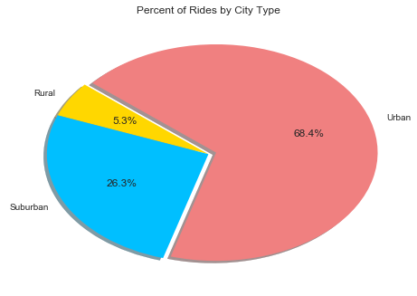
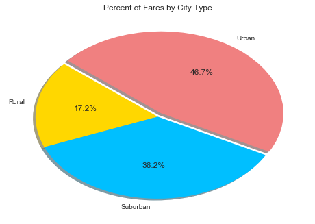

# Your objective is to build a Bubble Plot that showcases the relationship between four key variables:
Average Fare ($) Per City -         g_ride_avg
#Total Number of Rides Per City -    ride_sum
#Total Number of Drivers Per City-   num_driv
#City Type (Urban, Suburban, Rural)
#In addition, you will be expected to produce the following three pie charts:
#% of Total Fares by City Type
#% of Total Rides by City Type
#% of Total Drivers by City Type


```python
#Observable trends
#The most obvious trends relate to the city size.  
#    1: The larger the city, the more drivers there are.
#    2: The larger the city, the lower the average fare (obviously based upon distance traveled).
#    3: The smaller the city, the longer the distance, the greater the fare and fewer drivers. 
```


```python
import pandas as pd
import matplotlib.pyplot as plt
import seaborn as sns
import numpy as np
```


```python
path1="Generators/Pyber/generated_data/ride_data.csv"
path2="Generators/Pyber/generated_data/city_data.csv"
ride=pd.read_csv(path1,encoding="utf-8")
city=pd.read_csv(path2,encoding="utf-8")
#ride.head()
```


```python
#city.head()
```


```python
#len(ride)
```


```python
tot_fare=ride["fare"].sum()
#tot_fare
```


```python
#len(city)
```


```python
merge_ride_city=pd.merge(ride,city,on="city",how="left")
#len(merge_ride_city)
#merge_ride_city.head()
```


```python
mrc=merge_ride_city[["city","fare","ride_id","driver_count","type"]]
#mrc.head()
```


```python
#len(mrc)
```


```python
#Count of rides by city and type :
```


```python
mctr=mrc[["city","type","ride_id"]]
mctr2=mctr.groupby(["city","type"]).count()
mctr3=mctr2.reset_index()
#mctr3.head()
```


```python
#len(mctr3)
```


```python
#Add driver count to city, type and rides :
```


```python
mctrd=pd.merge(mctr3,city,on="city",how="outer")
mctrd2=mctrd[["city","type_x","ride_id","driver_count"]]
mctrd3=mctrd2.rename(columns={"type_x":"type","ride_id":"rides"})
#mctrd3.head()
```


```python
#len(mctrd3)
```


```python
mctf=merge_ride_city[["city","type","fare"]]
mctf2=mctf.groupby(["city","type"]).sum()
mctf3=mctf2.reset_index()
#mctf3.head()
```


```python
#len(mctf3)
```


```python
#Add sum of fares to city, type, rides and driver_count :
```


```python
mctrdf=pd.merge(mctrd3,mctf3,on="city",how="outer")
#mctrdf.head()
```


```python
mctrdf2=mctrdf[["city","type_x","rides","driver_count","fare"]]
#mctrdf2.head()
```


```python
mctrdf3=mctrdf2.rename(columns={"type_x":"type"})
mctrdf3.head()
```


<div>
<style>
    .dataframe thead tr:only-child th {
        text-align: right;
    }

    .dataframe thead th {
        text-align: left;
    }

    .dataframe tbody tr th {
        vertical-align: top;
    }
</style>
<table border="1" class="dataframe">
  <thead>
    <tr style="text-align: right;">
      <th></th>
      <th>city</th>
      <th>type</th>
      <th>rides</th>
      <th>driver_count</th>
      <th>fare</th>
    </tr>
  </thead>
  <tbody>
    <tr>
      <th>0</th>
      <td>Adamschester</td>
      <td>Suburban</td>
      <td>9</td>
      <td>27</td>
      <td>266.35</td>
    </tr>
    <tr>
      <th>1</th>
      <td>Alexisfort</td>
      <td>Urban</td>
      <td>33</td>
      <td>24</td>
      <td>903.11</td>
    </tr>
    <tr>
      <th>2</th>
      <td>Amberberg</td>
      <td>Suburban</td>
      <td>16</td>
      <td>13</td>
      <td>457.99</td>
    </tr>
    <tr>
      <th>3</th>
      <td>Anthonyfurt</td>
      <td>Suburban</td>
      <td>17</td>
      <td>17</td>
      <td>501.35</td>
    </tr>
    <tr>
      <th>4</th>
      <td>Boyleberg</td>
      <td>Suburban</td>
      <td>5</td>
      <td>13</td>
      <td>161.98</td>
    </tr>
  </tbody>
</table>
</div>


```python
#ride.count()
```


```python
#This section creates a bubble chart to compare fares, rides, drivers and cites
```


```python
rural_data=mctrdf3.loc[mctrdf3["type"]=="Rural",:]
r_data=pd.DataFrame(rural_data)
#r_data.head()
```


```python
r_data["Avg_fare"]=r_data["fare"]/r_data["rides"]
#r_data.head()
```


```python
sub_data=mctrdf3.loc[mctrdf3["type"]=="Suburban",:]
s_data=pd.DataFrame(sub_data)
s_data["Avg_fare"]=s_data["fare"]/s_data["rides"]
#s_data.head()

```


```python
urban_data=mctrdf3.loc[mctrdf3["type"]=="Urban",:]
u_data=pd.DataFrame(urban_data)
u_data["Avg_fare"]=u_data["fare"]/u_data["rides"]
#u_data.head()
```


```python
x_axis_s=s_data["rides"]
x_axis_u=u_data["rides"]
x_axis_r=r_data["rides"]
y_axis_s=s_data["Avg_fare"]
y_axis_u=u_data["Avg_fare"]
y_axis_r=r_data["Avg_fare"]
size_s=s_data["driver_count"]
size_u=u_data["driver_count"]
size_r=r_data["driver_count"]
c_type_s=s_data["type"]
c_type_u=u_data["type"]
c_type_r=r_data["type"]
```


```python
plt.scatter(x_axis_s,y_axis_s,marker="o",facecolors="lightskyblue",edgecolors="black",s=size_s*10,alpha=0.75, label="Suburban")
plt.scatter(x_axis_u,y_axis_u,marker="o",facecolors="coral",edgecolors="black",s=size_u*10,alpha=0.75,label="Urban")
plt.scatter(x_axis_r,y_axis_r,marker="o",facecolors="gold",edgecolors="black",s=size_r*10,alpha=0.75,label="Rural")
plt.title("Pyber Ride Sharing Data (2016)")
plt.xlabel("Total # of Rides by City")
plt.ylabel("Average Fares ($)")
plt.legend(loc="upper right")
plt.savefig("Scatter Ride Sharing.png")
plt.show()
```


```python
#This section starts the pie chart comparing rides by city type
```


```python
rides_by_city_type=mctrdf3[["type","rides"]]
#rides_by_city_type.head()
```


```python

rbct=rides_by_city_type.groupby(["type"])
c_ride=rbct.sum()
cy_ride=c_ride.reset_index()
#cy_ride.head()
```


```python
label1=cy_ride["type"]
slices=cy_ride["rides"]
colors1=["gold","deepskyblue","lightcoral"]
explode1=(0.0,0,0.05)
plt.pie(slices,explode=explode1,labels=label1,colors=colors1,shadow=True,autopct="%1.1f%%",startangle=140)
#plt.axis("equal")
plt.title("Percent of Rides by City Type")
plt.savefig("rides_by_city.png")
plt.show()
```





```python
#This section looks at % of fares by city type
```


```python
fares_by_city_type=mctrdf3[["type","fare"]]
```


```python
fbct=fares_by_city_type.groupby(["type"])
c_fare=fbct.sum()
cy_fare=c_fare.reset_index()
```


```python
label4=cy_fare["type"]
slices4=cy_fare["fare"]
colors4=["gold","deepskyblue","lightcoral"]
explode4=(0,0,0.05)
plt.pie(slices4,explode=explode4,labels=label4,colors=colors4,shadow=True,autopct="%1.1f%%",startangle=140)
plt.title("Percent of Fares by City Type")
plt.savefig("fares2_by_city.png")
plt.show()
```





```python
#This section looks at drivers by city type :
```


```python
drivers_by_city_type=mctrdf3[["type","driver_count"]]
```


```python
dbct=drivers_by_city_type.groupby(["type"])
c_driver=dbct.sum()
cy_driver=c_driver.reset_index()
```


```python
label2=cy_driver["type"]
slices2=cy_driver["driver_count"]
colors2=["gold","deepskyblue","lightcoral"]
explode2=(0.0,0,0.05)
plt.pie(slices2,explode=explode2,labels=label2,colors=colors2,shadow=True,autopct="%1.1f%%",startangle=140)
plt.title("Percent of Drivers by City Type")
plt.savefig("drivers_by_city.png")
plt.show()
```


```python
# This section compares the % of drivers by city type
```


```python
sns.lmplot(x="rides",y="fare",data=r_data,fit_reg=False,size=10,hue="type")
sns.lmplot(x="rides",y="fare",data=u_data,fit_reg=False,size=10,hue="type")
sns.lmplot(x="rides",y="fare",data=s_data,fit_reg=False,size=10,hue="type")
```


    <seaborn.axisgrid.FacetGrid at 0x11dff5cf8>


```python
plt.show()
```


